ST558 Project1
================
Owen Snyder
2022-06-26

-   [The Main Purpose](#the-main-purpose)
-   [Necessary Packages](#necessary-packages)
-   [Functions to Query Data](#functions-to-query-data)
    -   [Function for Daily Open/Close for
        Stocks](#function-for-daily-openclose-for-stocks)
    -   [Function for Daily Open/Close for
        Crypto](#function-for-daily-openclose-for-crypto)
    -   [Function for Aggregates(Bars) Stock
        Data](#function-for-aggregatesbars-stock-data)
    -   [Function for Aggregates(Bars) Crypto
        Data](#function-for-aggregatesbars-crypto-data)
    -   [Function for All Exchanges the API
        carries](#function-for-all-exchanges-the-api-carries)
    -   [Function to find Grouped Daily(Bars) for All
        Stocks](#function-to-find-grouped-dailybars-for-all-stocks)
-   [Exploratory Data Analysis](#exploratory-data-analysis)
    -   [Extract S&P 500 (SPY) Data](#extract-sp-500-spy-data)
    -   [Extract Vanguard 500 Index Fund (VOO)
        Data](#extract-vanguard-500-index-fund-voo-data)
    -   [Extract Bitcoin (BTC) Data](#extract-bitcoin-btc-data)
    -   [Extract Ethereum (ETH) Data](#extract-ethereum-eth-data)
    -   [Contingency Tables](#contingency-tables)
    -   [Numerical Summaries](#numerical-summaries)
    -   [Histograms: SPY, VOO, BTC, ETH](#histograms-spy-voo-btc-eth)
    -   [Boxplots: SPY, VOO, BTC, ETH](#boxplots-spy-voo-btc-eth)
    -   [Time Series Graph for SPY, VOO, BTC,
        ETH](#time-series-graph-for-spy-voo-btc-eth)
    -   [Scatter Plots for SPY, VOO, BTC,
        ETH](#scatter-plots-for-spy-voo-btc-eth)

# The Main Purpose

This is a complete vignette on how to use the Polygon.io API to extract
financial data that can be used for analysis. First, it is important to
to know what exactly a vignette is and why it is useful.

Vignettes are a great way to learn about a concept by including
informative text, code, and output throughout. They can be informative
and give someone a user-friendly way to work your concept or program.

This project will focus on contacting the Polygon.io API and build
functions to pull data on various financial endpoints.

After I have built the necessary functions, I will use some of them to
pull data to conduct an Exploratory Data Analysis on the stock and
crypto currency markets.

You can find the [Polygon.io](https://polygon.io/docs/getting-started)
API by clicking the link!

# Necessary Packages

These are all of the packages I used to complete this project:

-   `tidyverse` is a collection of useful packages designed for data
    science.  
-   `ggplot2` is an amazing way to create visually pleasing and
    informative graphics.
-   `httr` is a collection of useful functions for using APIs.
-   `jsonlite` is useful package for working with JSON objects in R.
-   `lubridate` is useful package for dealing with dates and times in R.
-   `rmarkdown` is a useful package for creating R Markdown documents in
    a variety of formats.
-   `knitr` is a useful package to integrate computing and reporting.

``` r
library(tidyverse)
library(ggplot2)
library(httr)
library(jsonlite)
library(lubridate)
library(rmarkdown)
library(knitr)
```

# Functions to Query Data

I will now create six functions to query data from certain endpoints
from the Polygon.io API.

## Function for Daily Open/Close for Stocks

This function will take in values of a ticker of a given stock, the date
(day) you want to look at, and whether or not you want adjusted splits.

``` r
getDailyOC <- function(stocksTicker,date,adjusted){
  adj <- ifelse(adjusted, "true", "false") ## setting adjusted to be only true or false
  link <- paste0("https://api.polygon.io/v1/open-close/",stocksTicker,"/",date,"?adjusted=",adj,
                 "&apiKey=O5bhHpJ7TFFBgq7bUJp8TA7Yi7uDLMIe")
  ## the link to connect to the API endpoint
  fromJSON(readLines(link,warn = FALSE))
 ## here we are converting a JSON object into a usable R object and suppressing warnings
}
## test the function with a ticker
## getDailyOC(stocksTicker = "SPY", date = "2021-10-12", adjusted = TRUE)
```

## Function for Daily Open/Close for Crypto

This function will take in values for the symbol of a given
cryptocurrency, the currency you want the crypto to be converted into,
the date (day) you want to look at, and and whether or not you want
adjusted splits.

``` r
getCryptoOC <- function(symbol, to, date, adjusted,...){
  adj <- ifelse(adjusted, "true", "false") ## setting adjusted to be only true or false
  link <-  paste0("https://api.polygon.io/v1/open-close/crypto/",symbol,"/",to,"/",date,"?adjusted="
                  ,adj,"&apiKey=O5bhHpJ7TFFBgq7bUJp8TA7Yi7uDLMIe")
  ## the link to connect to the API endpoint
  fromJSON(readLines(link,warn = FALSE))
  ## here we are converting a JSON object into a usable R object and suppressing warnings
}

## test the function with a crypto ticker
## getCryptoOC(symbol = "ETH", to = "USD", date = "2021-10-12", adjusted = TRUE)
```

## Function for Aggregates(Bars) Stock Data

This function will take in a stocks ticker, multiplier, time span, date
range values (from and to),adjusted splits, a sort option, and a limit
value.  
Note: the pre-inputted arguments are for common defaults. they can be
changed per the users request.

``` r
getAgg <- function(stocksTicker,multiplier,timespan="day",from,to,adjusted,sort="desc",limit=5000){
  
  adj <- ifelse(adjusted, "true", "false") ## setting adjusted to be only true or false
  multiplier <- as.integer(multiplier) ## multiplier must be an integer 
  timespan <- match.arg(timespan,choices = c("minute", "hour", "day", "week", "month",
                                             "quarter", "year"))
  ## provide a list of time span choices the URL and function will be able to include
  sort <- match.arg(sort, choices = c("asc", "desc"))
  ## establish the sort of how you want data to be printed 
  limit <- as.integer(limit)
  if (limit > 50000)
    stop("limit must be less than 50000")
  if(limit < 1)
    stop("limit must be greater than 1")
  ## set limit conditions and stop the function if they fail
    
  link <-  paste0("https://api.polygon.io/v2/aggs/ticker/",stocksTicker,"/range/",multiplier,"/"
                  ,timespan,"/",from,"/",to,"?adjusted=",adj,"&sort=",sort,"&limit=",limit,
                  "&apiKey=O5bhHpJ7TFFBgq7bUJp8TA7Yi7uDLMIe")
  ## the link to connect to the API endpoint
  output <- fromJSON(readLines(link,warn = FALSE))
  ## here we are converting a JSON object into a usable R object and suppressing warnings
  
  return(output$results)
  ## return only the results(data) 
  
}

## test the function
## get.appl <- getAgg("AAPL", multiplier = 1, timespan = "day", from = "2020-10-01", 
## to= "2022-06-15",adjusted = TRUE, sort = 'desc', limit = 6000)
```

## Function for Aggregates(Bars) Crypto Data

This function will take in a crypto ticker, a multiplier value, a time
span, date ranges (from and to), adjusted splits, a sort option, and
limit value.

``` r
getAggCryp <- function(cryptoTicker,multiplier,timespan="day",from,to,adjusted,
                       sort="desc", limit=5000){
  
  adj <- ifelse(adjusted, "true", "false") ## setting adjusted to be only true or false
  multiplier <- as.integer(multiplier) ## multiplier must be an integer
  timespan <- match.arg(timespan,choices = c("minute", "hour", "day", "week", "month", 
                                             "quarter", "year"))
  ## provide a list of time span choices the URL and function will be able to include
  sort <- match.arg(sort, choices = c("asc", "desc"))
  ## establish the sort of how you want data to be printed
  limit <- as.integer(limit)
  if (limit > 50000)
    stop("limit must be less than 50000")
  if(limit < 1)
    stop("limit must be greater than 1")
  
  
  link <- paste0("https://api.polygon.io/v2/aggs/ticker/",cryptoTicker,"/range/",multiplier,"/"
                 ,timespan,"/",from,"/",to,"?adjusted=",adj,"&sort",sort,"&limit=",limit,
                 "&apiKey=O5bhHpJ7TFFBgq7bUJp8TA7Yi7uDLMIe")
  ## the link to connect to the API endpoint
  output <- fromJSON(readLines(link,warn = FALSE))
  return(output$results) ## return only the results(data)
}

## test function
## get.eth <- getAgg("X:ETHUSD", multiplier = 1, timespan = "day", from = "2021-10-01", 
## to = "2022-12-31", adjusted = TRUE, sort = 'desc', limit = 5000)
```

## Function for All Exchanges the API carries

This function will take in an asset class (options specified below) and
a locale (location).

``` r
getEXCH <- function(asset_class,locale){
  
  asset_class <- match.arg(asset_class, choices = c("stocks","options","crypto","fx"))
  ## choices for asset_class must be these four
  locale <- match.arg(locale, choices = c("us","global"))
  ## locale must be US or global
  link <- paste0("https://api.polygon.io/v3/reference/exchanges?asset_class=",asset_class,
                 "&apiKey=O5bhHpJ7TFFBgq7bUJp8TA7Yi7uDLMIe")
  ## the link to connect to the API endpoint
  output <- fromJSON(readLines(link,warn = FALSE))
  return(output$results) ## return only the results section (data)
  
}

## test the function
## get.all <- getEXCH(asset_class = "stocks", locale = "us")
```

## Function to find Grouped Daily(Bars) for All Stocks

This functions will get the daily open, high, low, and close for the
entire stocks/equities markets.

``` r
## Get the daily open, high, low, and close (OHLC) for the entire stocks/equities markets

getGroupBars <- function(date, adjusted, include_otc){
  adj <- ifelse(adjusted, "true", "false") ## setting adjusted to be only true or false
  otc <- ifelse(include_otc, "true", "false") ## setting include_otc to be only true or false
  link <- paste0("https://api.polygon.io/v2/aggs/grouped/locale/us/market/stocks/",date,"?adjusted="
                 ,adj,"&apiKey=O5bhHpJ7TFFBgq7bUJp8TA7Yi7uDLMIe")
  ## the link to connect to the API endpoint
  output <- fromJSON(readLines(link,warn = FALSE))
  return(output$results) 
  ## return only the results (data)
}

## test function
## getGroupBars(date = "2021-10-12", adjusted = TRUE, include_otc = TRUE)
```

# Exploratory Data Analysis

Modeling stock and cryptocurrency performance can be a challenging task
as there are many different measures we can assess. You may want to
analyze one stock or a portfolio of stocks, and you may want to look at
how risky these positions are.

In this Exploratory Data Analysis, I will pull data from the S&P 500 and
the Vanguard 500 Index Fund as my two traditional stock market
exchange-traded funds. I will also pull data from Bitcoin and Ethereum
from the same date window as my traditional stocks. **The range of data
that I will be analyzing is June 15, 2021 to June 15, 2022.**

The big question will be: How do these stocks and cryptocurrencies
compare against each other? In the past year, the stock market has been
extremely volatile and the conversation and usage of cryptocurrencies
has skyrocketed. I will be analyzing the S&P 500 against the Vanguard
500 based on different market variables. I well then do the same
analysis on Bitcoin and Ethereum to see how well they perform against
each other. I will be looking at variables such as the Number of
Transactions in a given day for a specific position and the Open and
Close Price on a given day in my time window.

I will also be creating a very important new variable that is used
throughout finance, that being Log Returns. Log returns are extremely
important in financial analysis because it gives us the ability to
assume a Normal distribution. This assumption becomes extremely powerful
when risk analytics are performed (Value at Risk, Expected Shortfall).
However, in the scope of this project, Log Returns will still be useful
as it will give us the opportunity to visualize and quantify returns in
a more consistent manner.

Another important variable I will be creating is that of a Quarters
variable. Quarterly performances in finance are referenced often
throughout a fiscal year and they will give us a better understanding on
which quarters have been performing better or worse. By doing this, we
will be able to know what was the best time to have invested into a
stock or crypto based on quarterly Close Prices. Along with the Quarters
variable, another variable will be created to achieve a more
categorically pleasing way to look at quarter performance. I will be
creating a variable, “TransCategory” to categorize how many transactions
were made throughout the given time period.

NOTE: It is important to recognize the major market differences between
the traditional stock market and cryptocurrencies. Crypto is a 24/7
market whereas the stock market excludes weekends and holidays.

NOTE: Other variables will be created below but will not be analyzed
directly. Specifically, they will be part of the data wrangling process
and will be explained as they arise.

## Extract S&P 500 (SPY) Data

``` r
## use the getAgg function to pull S&P 500 data 
data.spy <- getAgg("SPY", multiplier = 1, timespan = "day", from = "2021-06-15", to= "2022-06-15",
                   adjusted = FALSE, sort = 'asc', limit = 5000)

## Now i am renaming column names 
colnames(data.spy) <- c('Volume', 'WeightedVolume', "Open", "Close", "HighestPrice",
                        "LowestPrice", "UnixTimes(msec)", "NumTransactions")

## adding a LogReturn variable (note: we set the first value to be zero because there are no 
## returns on the first trading day). Also adding a NumberObs variable to be able to graph 
## time series in the plots below. And adding a Symbol variable to assign to each data value.
## Also adding a Quarters variable and Transaction Category variable

SPY <- data.spy %>% mutate(LogRet = log(Close) - log(lag(Close))) %>% replace(is.na(.), 0) %>% 
       mutate(Symbol = 'SPY') %>% mutate(Nobs = row_number()) %>% mutate(Quarters = 
                           ifelse(Nobs %in% 1:12, "Q2",
                           ifelse(Nobs %in% 13:87, "Q3",
                           ifelse(Nobs %in% 88:144, "Q4",
                           ifelse(Nobs %in% 155:208, "Q1", "Q2"))))) %>%
    mutate(TransCategory = ifelse(NumTransactions %in% 1000000:3263011, "Many",
                           ifelse(NumTransactions %in% 650000:1000000, "Average",
                           ifelse(NumTransactions %in% 0:650000, "Few", "NONE"))))
```

## Extract Vanguard 500 Index Fund (VOO) Data

``` r
## use the getAgg function to pull Vanguard 500 data 
data.voo <- getAgg("VOO", multiplier = 1, timespan = "day", from = "2021-06-15", to= "2022-06-15",
                   adjusted = FALSE, sort = 'asc', limit = 5000)

## Now I am renaming column names 
colnames(data.voo) <- c('Volume', 'WeightedVolume', "Open", "Close", "HighestPrice",
                        "LowestPrice", "UnixTimes(msec)", "NumTransactions")

## adding a LogReturn variable (note: we set the first value to be zero because there are no 
## returns on the first trading day). Also adding a NumberObs variable to be able to graph 
## time series in the plots below. And adding a Symbol variable to assign to each data value. 
## Also adding a Quarters variable and a Transaction Category variable
VOO <- data.voo %>% mutate(LogRet = log(Close) - log(lag(Close))) %>% replace(is.na(.), 0) %>% 
       mutate(Symbol = "VOO") %>% mutate(Nobs = row_number()) %>% mutate(Quarters = 
                           ifelse(Nobs %in% 1:12, "Q2",
                           ifelse(Nobs %in% 13:87, "Q3",
                           ifelse(Nobs %in% 88:144, "Q4",
                           ifelse(Nobs %in% 155:208, "Q1", "Q2"))))) %>% 
    mutate(TransCategory = ifelse(NumTransactions %in% 200000:488939, "Many",
                           ifelse(NumTransactions %in% 90000:200000, "Average",
                           ifelse(NumTransactions %in% 0:90000, "Few", "NONE"))))
```

## Extract Bitcoin (BTC) Data

``` r
## use the getAggCryp function to pull Bitcoin Data
data.btc <- getAggCryp("X:BTCUSD", multiplier = 1, timespan = "day", from = "2021-06-15", 
                       to = "2022-06-15", adjusted = FALSE, sort = 'asc', limit = 5000)
## Now change column names again
colnames(data.btc) <- c('Volume', 'WeightedVolume', "Open", "Close", "HighestPrice",
                        "LowestPrice", "UnixTimes(msec)", "NumTransactions")

## adding a LogReturn variable (note: we set the first value to be zero because there are no 
## returns on the first trading day). Also adding a Date variable , Quarters variable, a 
## TransCategory variable, and a Symbol variable
BTC <- data.btc %>% mutate(LogRet = log(Close) - log(lag(Close))) %>% replace(is.na(.), 0) %>% 
       mutate(Symbol = "BTC") %>% mutate(Date = range) %>% mutate(Quarters = fin.quarters) %>%
       mutate(TransCategory = ifelse(NumTransactions %in% 800000:2240555, "Many",
                              ifelse(NumTransactions %in% 500000:800000, "Average",
                              ifelse(NumTransactions %in% 0:500000, "Few", "NONE"))))
```

## Extract Ethereum (ETH) Data

``` r
## use the getAggCryp function to pull Ethereum Data
data.eth <- getAggCryp("X:ETHUSD", multiplier = 1, timespan = "day", from = "2021-06-15", 
                       to = "2022-06-15", adjusted = FALSE, sort = 'asc', limit = 5000)
## now change column names
colnames(data.eth) <- c('Volume', 'WeightedVolume', "Open", "Close", "HighestPrice",
                        "LowestPrice", "UnixTimes(msec)", "NumTransactions")

## adding a LogReturn variable (note: we set the first value to be zero because there are no 
## returns on the first trading day). Also adding a Date variable , Quarters variable, a 
## TransCategory variable and a Symbol variable
ETH <- data.eth %>% mutate(LogRet = log(Close) - log(lag(Close))) %>% replace(is.na(.), 0) %>% 
       mutate(Symbol = "ETH") %>% mutate(Date = range, Quarters = fin.quarters) %>% 
       mutate(TransCategory = ifelse(NumTransactions %in% 800000:1852104, "Many",
                              ifelse(NumTransactions %in% 500000:800000, "Average",
                              ifelse(NumTransactions %in% 0:500000, "Few", "NONE"))))
```

## Contingency Tables

I will now create contingency tables for the Number of Transactions
based on Quarters. I have grouped the Number of Transactions into three
main categories: Average, Few, or Many. This way, we will be able to
identify which quarters seemed to have which category of transaction.
For example, A quarter with a high count of “Many” transactions may
indicate a surging market. This could be an indication of a good time to
buy or sell your given position. Below, I will summarize my findings:

For the S&P 500 data, there is a high count of “Few” transactions in Q3,
this may be an indication of a slow market period for Q3 and in turn,
there are more people holding onto their stock in the S&P 500. We can
also see that there was a very low count of “Many”, indicating that
transaction numbers were down considerably.

For the Vanguard 500 data, there is also a high count of “Few”
transactions in Q3. This is similar to the S&P data and this gives us a
better idea of the stock market conditions in Q3.

For the Ethereum data, the trend is surprisingly the same. Q3 has the
highest count of “Few” transactions. This is important to note that the
quarterly transaction performance may be similar between the traditional
stock market and the crypto market.

Finally, the Bitcoin data also follows the same trend. Q3 has the
highest count of “Few” transactions.

Between the four contingency tables, I believe that it is safe to
conclude that an investor was best to hold their shares if they had any,
or not buy into the market during a slow Quarter 3 across the board of
the stock market and the crypto market.

``` r
## contingency table for SPY data, looking at TransCategory and Quarters, and switching to wide format
SPY %>% group_by(TransCategory,Quarters) %>% summarize(counts = n()) %>% 
    pivot_wider(values_from = counts, names_from = Quarters)

## contingency table for VOO data, looking at TransCategory and Quarters, and switching to wide format
VOO %>% group_by(TransCategory,Quarters) %>% summarize(counts = n()) %>% 
    pivot_wider(values_from = counts, names_from = Quarters)

## contingency table for BTC data, looking at TransCategory and Quarters, and switching to wide format
BTC %>% group_by(TransCategory,Quarters) %>% summarize(counts = n()) %>% 
    pivot_wider(values_from = counts, names_from = Quarters)

## contingency table for ETH data, looking at TransCategory and Quarters, and switching to wide format
ETH %>% group_by(TransCategory,Quarters) %>% summarize(counts = n()) %>% 
    pivot_wider(values_from = counts, names_from = Quarters)
```

## Numerical Summaries

Next, I will display some quantitative summaries for all four positions.
The goal of these summaries is to show the success of each position
based on fiscal quarters and we hope to identify quarters where the
average value of returns is positive. When investing, your main goal is
to maximize your return on investment. It is also important to note the
average value of the Open and Close Price, standard deviation of Log
Returns and the average Number of Transactions. These will help paint a
better picture of what goes into a strong return for each quarter.

Starting with S&P 500 summaries, the quarter with the worst performance
on average Log Returns was Q2. It also had the lowest average Close
Price which solidifies that this was a poor quarter for investments into
the S&P 500. On the other hand, Q4 produced the highest average Log
Returns.

As expected, the Vanguard 500 stock also had the worst performance of
average Log Returns and average Close Price for Q2. Again, Q4 produced
the highest average Log Returns.

Switching into the crypto-realm, Bitcoin produced poor average Log
Returns for both Q1 and Q2. Conversely, Q3 had the highest average Log
Returns.

For Ethereum, we see a similar trend in that Q1 and Q2 produced the
worst average Log Returns. Again, Q3 produced the best average Log
Returns.

These numerical summaries provide key insight in that the positions in
the traditional stock market followed the same trends. Also, the
cryptocurrecies tended to follow the same trends as well. Most
importantly, it is apparent that the two different markets experienced
different quarters of growth and returns.

``` r
## quantitative summaries for each position data 
## I am using the mean of Open, Close, LogRet, NumTransactions, and standard deviation of LogRet

## SPY data
SPY %>% group_by(Quarters) %>% summarise(avgOpen = mean(Open), avgClose = mean(Close), 
                                         avgLogRet = mean(LogRet), sdLogRet = sd(LogRet),
                                         avgTrans = mean(NumTransactions))

## VOO data
VOO %>% group_by(Quarters) %>% summarise(avgOpen = mean(Open), avgClose = mean(Close), 
                                         avgLogRet = mean(LogRet), sdLogRet = sd(LogRet),
                                         avgTrans = mean(NumTransactions))
## BTC data
BTC %>% group_by(Quarters) %>% summarise(avgOpen = mean(Open), avgClose = mean(Close), 
                                         avgLogRet = mean(LogRet),sdLogRet = sd(LogRet),
                                         avgTrans = mean(NumTransactions))

## ETH data
ETH %>% group_by(Quarters) %>% summarise(avgOpen = mean(Open), avgClose = mean(Close), 
                                         avgLogRet = mean(LogRet),sdLogRet = sd(LogRet),
                                         avgTrans = mean(NumTransactions))
```

## Histograms: SPY, VOO, BTC, ETH

Here I am modeling the number of transactions across all four positions
via histograms because I want to get a better idea of how the data for
the transactions are distributed.

Both of the histograms for S&P 500 and Vanguard 500 show signs of
extreme right-skew. Conversely, the histograms for Bitcoin and Ethereum
are better distributed and show less signs of skew. In fact, they are
almost normally distributed. I find it interesting that the histograms
for the crypto currencies show a more consistent distribution compared
to the traditional stocks.

``` r
## histogram for SPY
hist.spy <- ggplot(data = SPY, aes(x = NumTransactions))
hist.spy + geom_histogram(bins = 35, fill = "lightblue", colour = 8) +
           ggtitle("Histogram of Transactions: S&P 500")
```

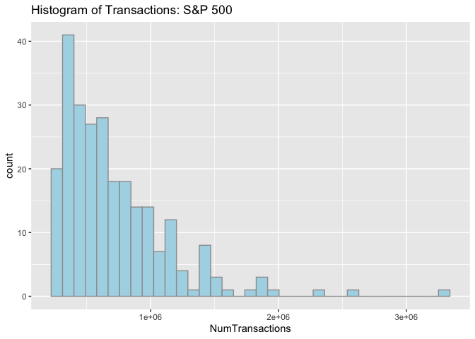<!-- -->

``` r
## histogram for VOO
hist.voo <- ggplot(data = VOO, aes(x = NumTransactions))
hist.voo + geom_histogram(bins = 35, fill = "lightblue", colour = 8) +
           ggtitle("Histogram of Transactions: Vanguard 500")
```

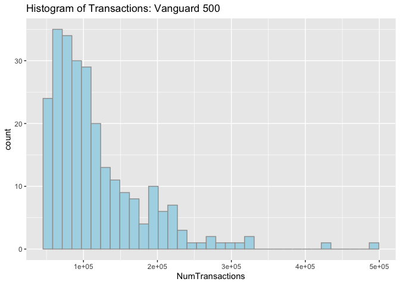<!-- -->

``` r
## histogram for BTC
hist.btc <- ggplot(data = BTC, aes(x = NumTransactions))
hist.btc + geom_histogram(bins = 35, fill = "lightblue", colour = 8) +
           ggtitle("Histogram of Transactions: Bitcoin")
```

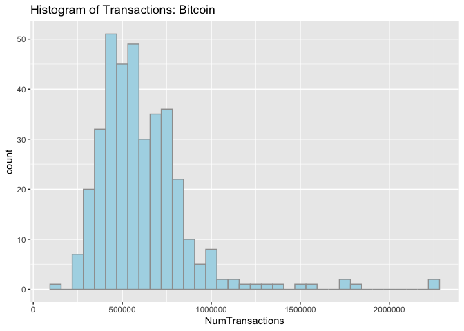<!-- -->

``` r
## histogram for ETH
hist.eth <- ggplot(data = ETH, aes(x = NumTransactions))
hist.eth + geom_histogram(bins = 35, fill = "lightblue", colour = 8) +
           ggtitle("Histogram of Transactions: Ethereum")
```

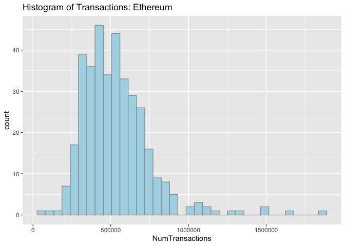<!-- -->

## Boxplots: SPY, VOO, BTC, ETH

Below are boxplots that assess quarterly performance of Close Prices.
The closing price of a stock is extremely useful because it allows
investors to assess the changes in stock prices over time. This will
provide a visual on which quarters are deemed the most “expensive” in
terms of the Close Price.

First, the boxplot for the S&P 500 shows how volatile Q2 was for the
Close Price which can be related to how poor the average Log Returns
were for that quarter. That plot shows a very large spread compared to
the others. Conversely, the boxplot for Q3 has a tight spread,
indicating that this quarter’s Close Price did not vary much.

Second, the boxplot for the Vanguard 500 shows the volatility in Close
Price for Q2 and Q3 where the plots depict large amounts of spread.
Also, we see that Q4 shows the highest Close Prices.

For Bitcoin, Q3 and Q4 shows large amounts of spread and skew in terms
of Close Price. Whereas Q1 has a very tight plot with little spread.

For Ethereum, Q2 and Q3 show large amounts of spread and some skew.
Whereas Q1 and Q4 are quite similar and more consistent.

Because investing can be extremely unpredictable, we notice many
outliers throughout all four positions.

``` r
## boxplot for SPY
bp.spy <- ggplot(SPY, aes(x = Quarters, y = Close, fill = Quarters))
bp.spy + geom_boxplot() + geom_jitter() + ggtitle("Boxplot: S&P 500") +
         labs(y = "Close Price ($)")
```

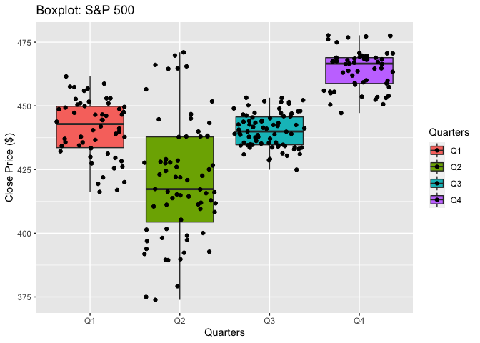<!-- -->

``` r
## boxplot for VOO
bp.voo <- ggplot(ETH, aes(x = Quarters, y = Close, fill = Quarters))
bp.voo + geom_boxplot() + geom_jitter() + ggtitle("Boxplot: Vanguard 500") +
         labs(y = "Close Price ($)")
```

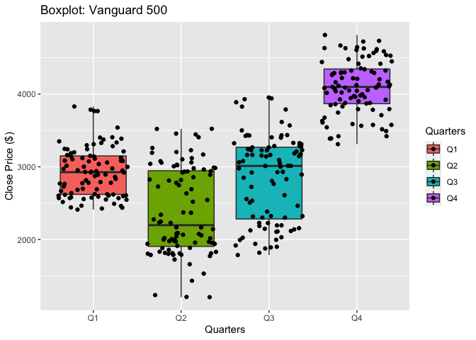<!-- -->

``` r
## boxplot of BTC
bp.btc <- ggplot(BTC, aes(x = Quarters, y = Close, fill = Quarters))
bp.btc + geom_boxplot() + geom_jitter() + ggtitle("Boxplot: Bitcoin") +
         labs(y = "Close Price ($)")
```

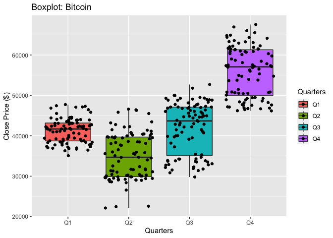<!-- -->

``` r
## boxplot for ETH
bp.eth <- ggplot(ETH, aes(x = Quarters, y = Close, fill = Quarters))
bp.eth + geom_boxplot() + geom_jitter() + ggtitle("Boxplot: Ethereum") + 
         labs(y = "Close Price ($)")
```

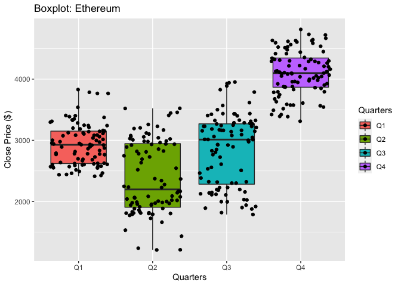<!-- -->

## Time Series Graph for SPY, VOO, BTC, ETH

Time series graphs are a great way to see how data changes as time
changes. Below are four time series graphs based on time and Log
Returns. We will be looking for constant trends and should take note of
extreme shifts.

First, for S&P 500, as time starts in June 2021 and ends in June 2022,
the graphs becomes much nosier and less constant. We can see that Log
Returns become much more unstable and volatile as we increase throughout
our year period.

Next, for Vanguard 500, we see a very similar trend. One might want to
do more data analysis or research why these Log Returns are so volatile
around that time period.

For the Bitcoin data, we see a fairly constant trend/pattern in Log
Returns as time increases. However, we actually see some similarity with
the stock positions where the data around June 2022 experiences a
considerable period of noise.

Lastly, the Ethereum graph tends to have a large shift in Log Returns,
then returns to a rather constant state and then exhibits those large
shifts again. Essentially, we see a very inconsistent and volatile
period of Log Returns for our given time period.

``` r
## time series graph for SPY
ts.spy <- ggplot(data = SPY, aes(x=Nobs))
ts.spy + geom_line(aes(y=LogRet), color = "purple") + 
         ggtitle("Time Series Plot on Log Returns for S&P 500") +
         theme(axis.text.x = element_text(vjust=0.5)) +
         theme(legend.position="none")
```

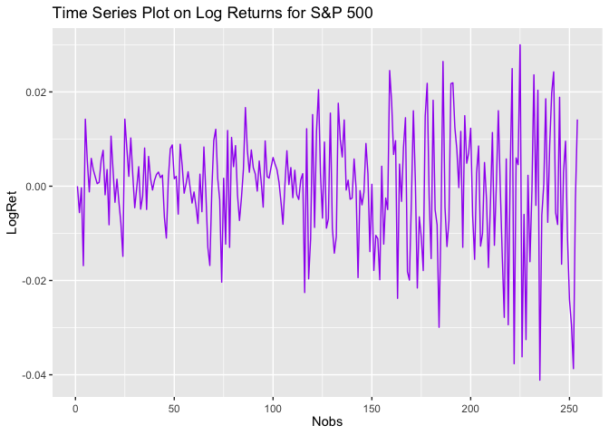<!-- -->

``` r
## time series graph for VOO
ts.voo <- ggplot(data = VOO, aes(x = Nobs))
ts.voo + geom_line(aes(y=LogRet), color = "darkblue") + 
         ggtitle("Time Series Plot on Log Returns for Vanguard 500") +
         theme(axis.text.x = element_text(vjust=0.5)) +
         theme(legend.position="none")
```

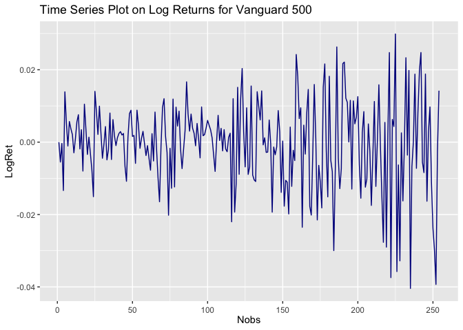<!-- -->

``` r
## time series graph for BTC
ts.btc <- ggplot(data = BTC, aes(x=Date)) 
ts.btc + geom_line(aes(y=LogRet), color = "red") + 
         ggtitle("Time Series Plot on Log Returns for Bitcoin") +
         theme(axis.text.x = element_text(angle = 90, vjust=0.5)) +
         theme(legend.position="none")
```

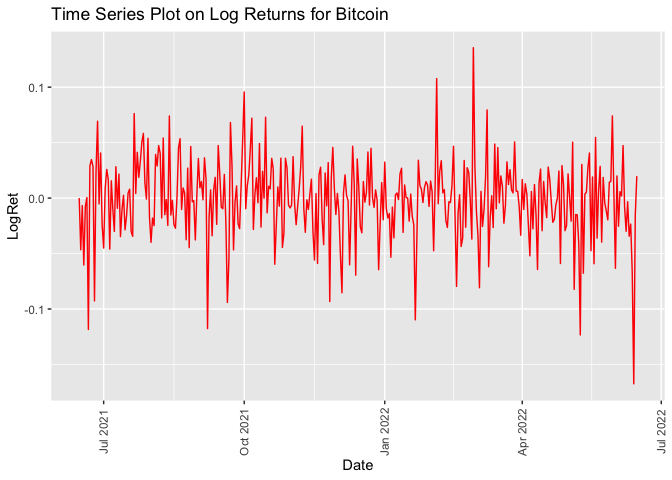<!-- -->

``` r
## time series graph for ETH
ts.eth <- ggplot(data = ETH, aes(x=Date)) 
ts.eth + geom_line(aes(y=LogRet), color = "blue") + 
         ggtitle("Time Series Plot on Log Returns for Ethereum") +
         theme(axis.text.x = element_text(angle = 90, vjust=0.5)) +
         theme(legend.position="none")
```

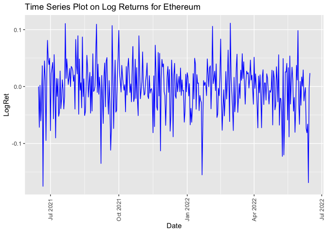<!-- -->

## Scatter Plots for SPY, VOO, BTC, ETH

Finally, I want to investigate if there is a relationship between the
Close Price and the Number of Transactions.

Unfortunately, there is not a strong correlation between the Close Price
and the Number of Transactions. Each position exhibits a negative
correlation in which that number is very low, indicating weak
correlation. Although each correlation is negative, the S&P 500 has the
largest correlation coefficent although it is negative. Also to note,
there are many cases of outliers present in each of the graphs. And the
points in each scatter plot tend to cluster around the average value of
the Close Price.

``` r
## Create scatterplots with a fitted regression line
## NOTE: i am keeping the SE argument true for all

## plot for SPY
cor.spy <- cor(SPY$Close,SPY$NumTransactions) ## find correlation to be able to plot on graph
sp.spy <- ggplot(data = SPY, aes(x = Close, y = NumTransactions))
sp.spy + geom_point() + geom_smooth(method = lm, col = "red") +
         ggtitle("Scatterplot for S&P 500") +
         labs(x = "Close Price ($)") +
         geom_text(x = 460, y = 3e+06, size = 5, label = paste0("Corr = ", round(cor.spy,2)))
```

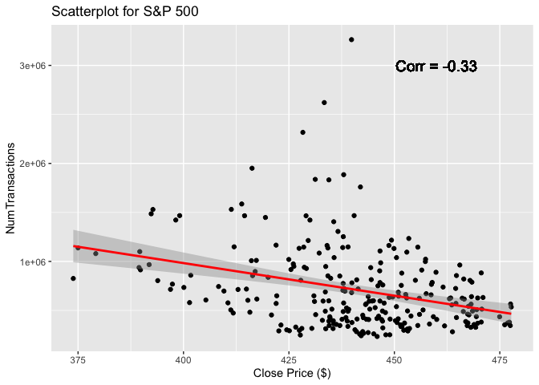<!-- -->

``` r
## plot for VOO
cor.voo <- cor(VOO$Close,VOO$NumTransactions) ## find correlation to be able to plot on graph
sp.voo <- ggplot(data = VOO, aes(x = Close, y = NumTransactions))
sp.voo + geom_point() + geom_smooth(method = lm, col = "red") +
         ggtitle("Scatterplot for Vanguard 500") +
         labs(x = "Close Price ($)") +
         geom_text(x = 430, y = 4e+05, size = 5, label = paste0("Corr = ", round(cor.voo,2)))
```

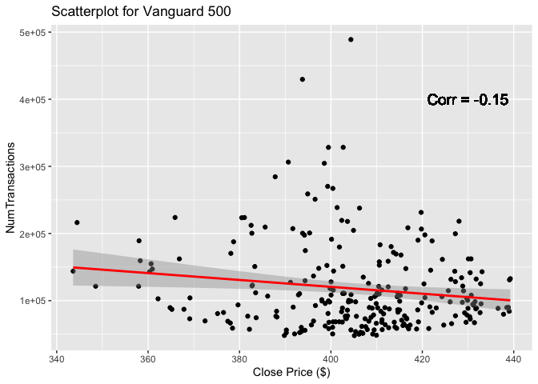<!-- -->

``` r
## plot for BTC
cor.btc <- cor(BTC$Close,BTC$NumTransactions) ## find correlation to be able to plot on graph
sp.btc <- ggplot(data = BTC, aes(x = Close, y = NumTransactions))
sp.btc + geom_point() + geom_smooth(method = lm, col ="purple") +
         ggtitle("Scatterplot for Bitcoin") +
         labs(x = "Close Price ($)") +
         geom_text(x = 60000, y = 2000000, size = 5, label = paste0("Corr = ", round(cor.btc,2)))
```

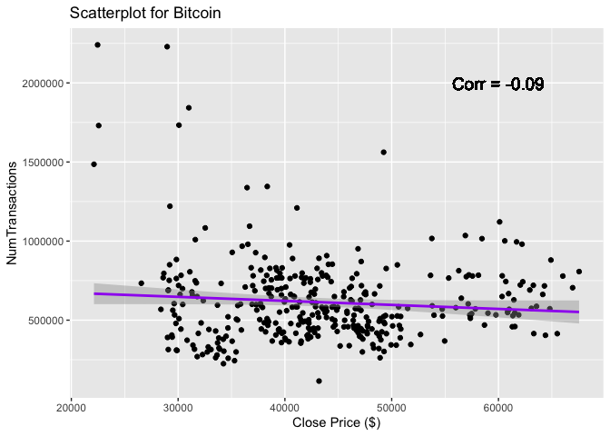<!-- -->

``` r
## plot for ETH
cor.eth <- cor(ETH$Close,ETH$NumTransactions) ## find correlation to be able to plot on graph
sp.eth <- ggplot(data = ETH, aes(x = Close, y = NumTransactions))
sp.eth + geom_point() + geom_smooth(method = lm, col = "purple") +
         ggtitle("Scatterplot for Ethereum") + 
         labs(x = "Close Price ($)") +
         geom_text(x = 4500, y = 1500000, size = 5, label = paste0("Corr = ", round(cor.eth,2)))
```

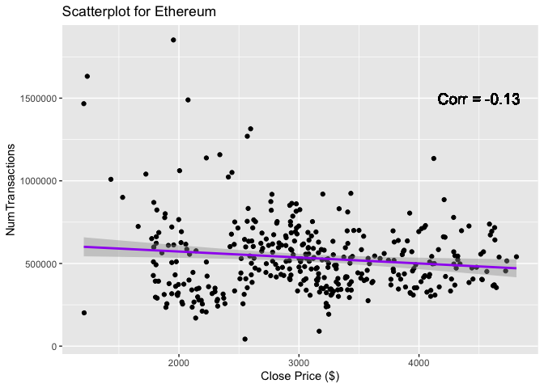<!-- -->
